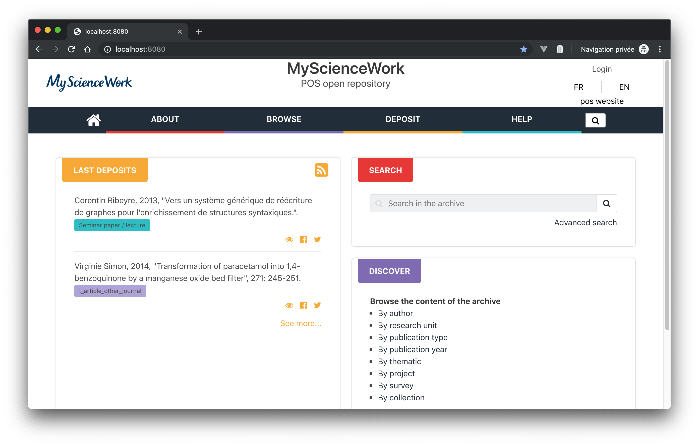
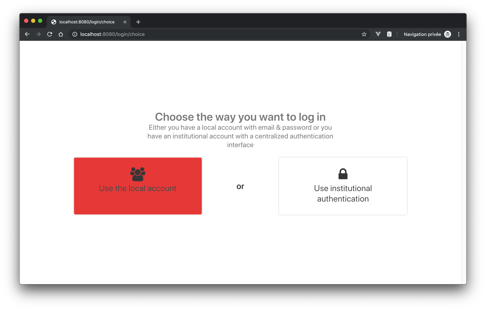
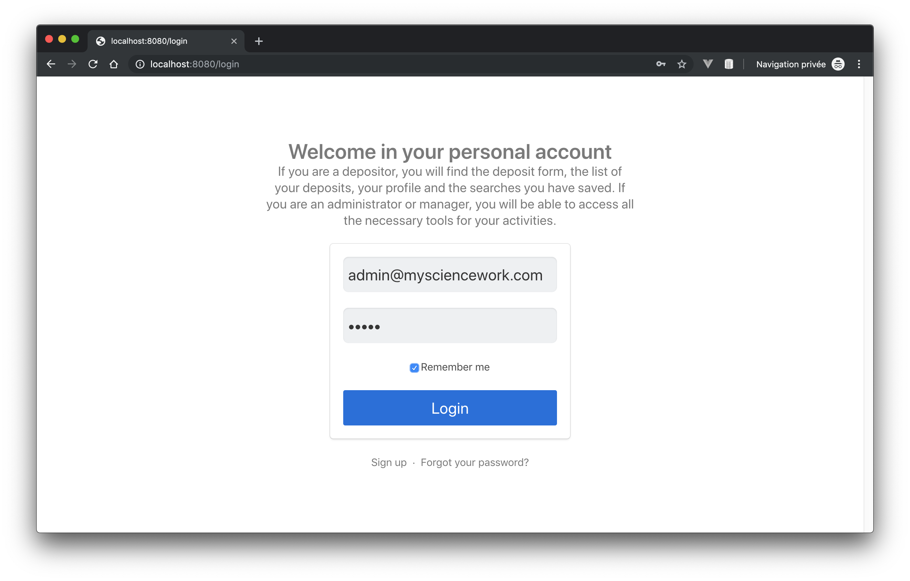
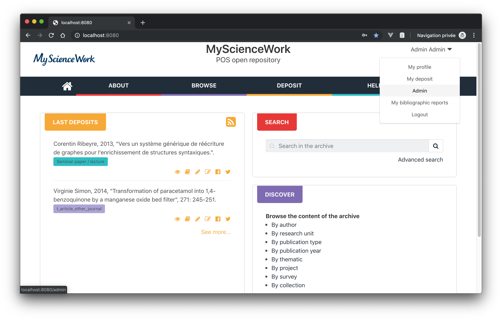
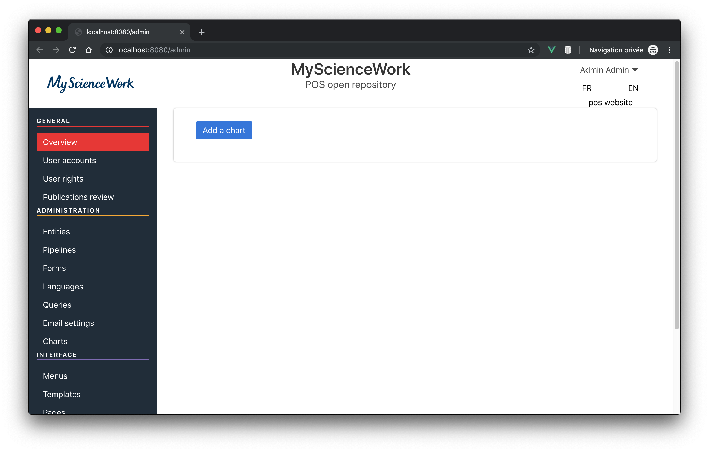

PolarisOS: Deployment
==============================================


Polaris OS is a data-driven repository and data analysis solution for the services of scientific institutions. This is a major technological breakthrough to improve data management, research impact analysis and user experience. MyScienceWork has chosen to share the Polaris OS code on GitHub. This choice responds to the need for research institutes to have open, independent and sustainable solutions. In a constantly evolving technological environment, the start-up believes in the importance of sharing knowledge.

Requirements:

* docker-compose 1.24.0
[https://docs.docker.com/compose/install/](https://docs.docker.com/compose/install/)

## Getting started

You can start a demonstration of Polaris OS with docker-compose.
A provided `docker-compose.yml` file will provision the following set of services:

- elasticsearch (database)
- app (Polaris OS application)
- bootstrap (sample data to start with PolarisOS)

To start, clone this repository : 
```
git clone https://github.com/MyScienceWork/PolarisOS-deployment.git
cd PolarisOS-deployment
```
Start application stack with docker-compose :
```
docker-compose up
```

Please wait for these lines :
```
info: Starting koalication...
info: PolarisOS started on port 5556
info: PolarisOS environment => production
info: Grobid host:port => grobid:8080
info: Minio host:port => minio:9000
```

Open your browser and go to :
[http://localhost:8080](http://localhost:8080)

Running CTRL+C will stop the containers.

Administration account :

- email: admin@mysciencework.com
- password: admin

**This repository is for demonstration purpose only DO NOT USE IT IN PRODUCTION.**

## Start development

To start using Polaris OS, we recommend starting with "How to develop the solution?"
section in [the PolarisOS documentation](https://mysciencework.github.io/PolarisOS/manual/deployment.html).










